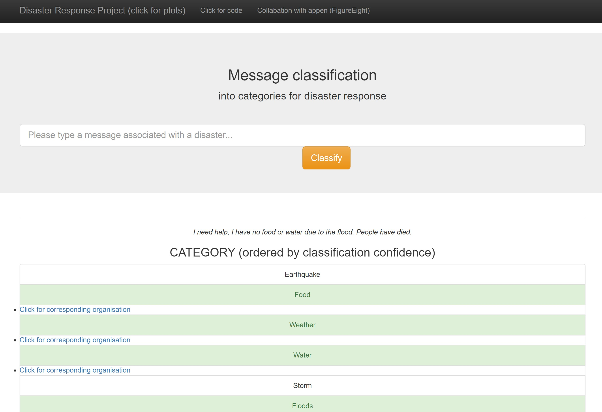
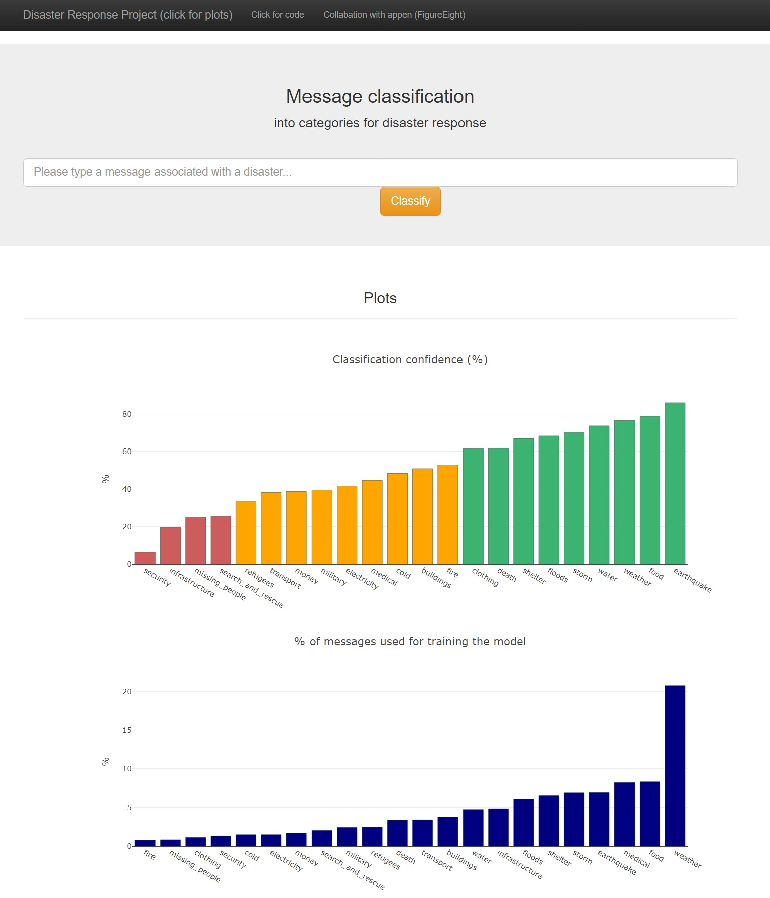

# Message Classification for Disaster Response 

An end-to-end Natural-Language-Processing (NLP) project to build a 
predictive model for an API that classifies disaster messages, so 
messages can be sent to the appropriate disaster relief agency.

## Table of Contents
1. [Introduction](#introduction)
2. [Objectives](#objectives)
3. [Getting Started](#getting_started)
    1. [Create Virtual Environment](#env)
    2. [Installing dependences](#installing)
    3. [Clone Repository](#clone)
    4. [Executing Program](#executing)
4. [File Structure](#files)
5. [Discussion](#discussion)
    1. [Confidence in results](#confidence-in-results)
    2. [Imbalanced data](#imbalanced-data)
    3. [Improvements](#improvements)
6. [Authors](#authors)
7. [License](#license)
8. [Acknowledgements](#acknowledgement)

<a name="introduction"></a>
## Introduction

After a disaster, responsible agencies typically receive millions of direct or social media communications
just when disaster response organizations are least able to filter and select the most important messages. 
Often, only one in a thousand messages is relevant for disaster response professionals. 

In order to group each message into the corresponding category/categories for each organisation, we start 
by evaluating the similarity between messages by assigning weights to the words in each message (based on 
their frequency), to signify their relevance. This is named 'Term-frequency (TF) - inverse document frequency
(IDF) or TF-IDF. This way of transforming the text highlights the words which are more unique to a message,
and is a good method for classifying messages. 

The model used in this project to classify each message is called 'eXtreme 
Gradient Boosting' or XGBoost. This method is based on the more well-known 'decision tree' classification, but 
with improved prediction performance, due to its weighting of the model outcomes in the previous timestep.
More accurate predictions are weighted accordingly to differentiate them from weaker predictions, and so
over time the model performance increases.

Note there is a very small improvement (~0.01) in the f-score after tuning hyperparameters, and minimal change 
to the conclusions drawn. There is also a much larger computational time, therefore GridSearchCV is excluded 
from the pipeline for the app.

<a name="objectives"></a>
## Objectives

The data is composed of pre-labelled tweets & text messages from Figure Eight www.appen.com.

1. ETL Pipeline to extract, clean data and save processed data to a SQL database.
2. Machine Learning Pipeline to train a supervised classification model to classify messages into appropriate categories.
3. Creation of a web application to classify any disaster message.

<a name="getting_started"></a>
## Getting Started

<a name="env"></a>
### Create Virtual Environment (Linux)

 `$ python3 -m venv disaster_venv`

 `$ source disaster_venv/bin/activate`

<a name="installing"></a>
### Installing dependences

`$ pip install -r requirements.txt`

<a name="clone"></a>
### Clone repository

```
git clone https://github.com/sophmm/Message_Classification_for_Disaster_Response
```

<a name="executing"></a>
### Executing Program
Run the following commands in the project's root directory to set up your database and model.

1. To run ETL pipeline that cleans data and stores in database
	
    `$ python data/process_data.py data/raw/disaster_messages.csv data/raw/disaster_categories.csv data/DisasterResponse.db`

		
2. To run ML pipeline that trains and saves the classifier model

    `$ python models/train-model.py data/processed/DisasterResponse.db model/classifier.pkl`

	
3. To run the app, move to the app's directory. 

    `$ python run.py`


4. Go to http://0.0.0.0:3001/ (or http://localhost:5000/ depending on your system)


<a name="file"></a>
## File Structure
~~~~~~~
message_classification_for_disaster_response
      |-- app
            |-- templates
                  |-- go.html
                  |-- master.html
            |-- run.py
      |-- data
            |-- processed
                  |-- DisasterResponse.db
            |-- raw
                  |-- disaster_message.csv
                  |-- disaster_categories.csv
            |-- process_data.py
            |-- process_data.ipynb
      |-- models
            |-- classifier.pkl
            |-- eval_df.pkl
            |-- train_model.py
            |-- ML_pipeline_prep.ipynb
      |-- README
      |-- screenshot_of_app.jpeg
      |-- requirements.txt
~~~~~~~

<a name="discussion"></a>
## Discussion 

<a name="confidence-in-results"></a>
### Confidence in results

The confidence of the classification for each category is shown in the plots on the web app (where
confidence is represented by 'f1-score', a combination of precision and recall).

How many of the relevant messages are categoried (recall)? The low recall score suggests true positives are not picked up and lots of relevant messages are missed, with a mean of 0.38 across all categories.

How many of the categoried messages are relevant (precision)? The precision score is much higher than the recall, with a mean of 0.64 across all categories, which suggests generally when a message is categorized it's normally correct.

As a result of low recall, the poorest performing categories (f-score < 0.3) are search and rescue, security, missing people and infrastructure (and tools/ shops). The messages in these categories are more likely to be missed/ not picked up.

The highest performing categories (f-score > 0.65) are mainly weather-related messages (e.g. storm, earthquake, floods) and food, water and shelter. This suggests these messages may be clearer or have more similar terminology, so it's easier for the model to classify them together.

<a name="imbalanced_data"></a>
### Imbalanced data
We know from the initial analysis of the dataset the categories are imbalanced, despite combining categories and removing irrevelant ones at the start (process_data.py). Generally for a category the larger number of messages (see process_data.py), the higher f-score with the exception of medical and infrastructure where the classifier still performs poorly, and with the exception of water where the classifier performs better with fewer messages.

<a name="improvements"></a>
### Improvements
The weakest performing categories need more attention: search and rescue, security, missing people and infrastructure.

Looking at what the specific messages are in these categories helps understand why the classifier struggles with these ones. The meaning of the text is often ambigous and there are often not any repeated/ familiar terminology. An example for each category is shown below:

1. search_and_rescue: 'There are a lot of criminals in Jacmel city. We are asking the police to come there.' and 'Hello, we are in the Petionville area we need tents, food and water'

2. security: "I would like to know if it's safe to sleep inside the house now or not"

3. missing_people: 'I have many problems. I live at Delma. My house is destroyed. We lost our mother, my entire family. ' and 'more than 1,100 people are still missing'

4. infrastructure: 'Hunger will end us in Arcahaie, Corail. ' and "I need help my house collapsed and I'm in the streets"

If I had more time I would train an NER model to identify key phrases/ words associated with each of these categories, e.g. 'lost' or 'missing' for missing_people or 'safe' for security.





<a name="authors"></a>
## Authors

* [sophmm](https://github.com/sophmm)

<a name="license"></a>

## License
[](https://opensource.org/licenses/MIT)

<a name="acknowledgement"></a>

## Acknowledgements

* [Udacity](https://www.udacity.com/) 
* [Figure Eight](https://www.figure-eight.com/)


